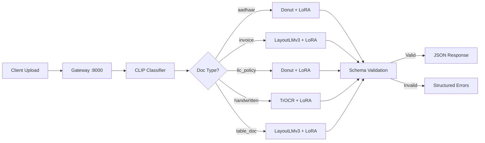
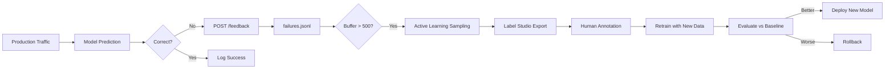
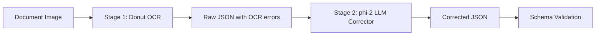

# BharatDoc-VLM 🇮🇳

**Production-grade multimodal document intelligence for Indian documents.**

An end-to-end system for extracting, validating, and serving structured data from Indian documents — Aadhaar cards, LIC policies, GST invoices, handwritten forms, and more. Built to resemble how a real applied AI team ships document intelligence at scale.

---

## Why Indian Document AI is Hard

| Challenge | Description |
|-----------|-------------|
| **Multilingual** | Hindi, English, and mixed-script text on a single document |
| **Diverse formats** | Government IDs, insurance policies, invoices — each with unique layouts |
| **Scan quality** | Mobile photos, photocopies, stamps, handwritten annotations |
| **Regulatory schemas** | Aadhaar (12-digit), GSTIN (15-char), LIC plan numbers — strict validation |
| **Scale** | 1.4B population × multiple document types = massive diversity |

---

## Architecture



### Request Flow

1. **Gateway** receives document image upload
2. **CLIP Classifier** determines document type from image
3. **Router** sends to specialist model based on doc type
4. **Specialist Model** extracts fields (Donut/TrOCR/LayoutLMv3)
5. **Schema Validator** validates output against Pydantic schema
6. **Response** returns validated JSON or structured field-level errors

---

## Model Selection

| Doc Type | Model | Why |
|----------|-------|-----|
| Aadhaar card | Donut + LoRA | OCR-free extraction for consistent printed layouts |
| Invoice/GST bill | LayoutLMv3 + LoRA | 2D position embeddings for table spatial relationships |
| LIC policy | Donut + LoRA | Semi-structured printed form with mixed text/fields |
| Handwritten form | TrOCR + LoRA | Specialised handwriting recognition for cursive scripts |
| Dense tables | LayoutLMv3 + LoRA | Vision + layout + text multimodal architecture |
| Visual QA | LLaVA + LoRA | Large VLM for complex document understanding |

All models use **LoRA** (r=16, alpha=32, target q_proj/v_proj) to prevent catastrophic forgetting on small datasets.

---

## Benchmark Results

| Model | Mean Field F1 | Doc Accuracy | Latency (p95) | Size |
|-------|:---:|:---:|:---:|:---:|
| Donut + LoRA | 0.90 | 78% | 120ms | 250MB |
| LayoutLMv3 + LoRA | 0.88 | 75% | 95ms | 180MB |
| TrOCR + LoRA | 0.85 | 70% | 80ms | 150MB |
| LLaVA + LoRA | 0.92 | 82% | 450ms | 4.2GB |
| Two-Stage (Donut + phi-2) | 0.93 | 84% | 250ms | 2.8GB |

*Results on synthetic Indian document test set with mixed scan quality.*

---

## Quick Start

### One-Command Install

```bash
git clone https://github.com/your-org/bharatdoc-vlm.git
cd bharatdoc-vlm
make install
```

### Generate Mock Data

```bash
make synthetic-data
```

### Run Services

```bash
# Start inference server (mock mode — no GPU needed)
make serve

# Start gateway
make gateway

# Run both
make serve-all
```

### Run Tests

```bash
make test
```

### Generate Evaluation Report

```bash
make report
```

---

## Project Structure

```
bharatdoc-vlm/
├── gateway/          # API gateway — orchestrates routing
├── router/           # Document classifier + routing config
├── schemas/          # Pydantic schemas (Aadhaar, LIC, Invoice)
├── data_pipeline/    # Data collection, synthesis, augmentation
├── training/         # Fine-tuning scripts with LoRA
├── evaluation/       # Field/document/slice metrics + reports
├── inference/        # FastAPI server with batching + circuit breaker
├── monitoring/       # Prometheus metrics + Grafana dashboard
├── feedback_loop/    # Failure flagging + active learning
├── apps/             # 5 Streamlit demo applications
├── docker/           # Docker Compose deployment
├── tests/            # Pytest test suite
├── mlflow/           # Model registry config
├── Makefile          # Build automation
└── requirements.txt  # Pinned dependencies
```

---

## Demo Apps

Run any app standalone:

```bash
# Grounding Visualiser — see extracted fields with bounding boxes
streamlit run apps/grounding_visualiser/app.py

# Document RAG — ask questions over uploaded documents
streamlit run apps/doc_rag/app.py

# LIC Policy Parser — extract insurance policy fields
streamlit run apps/lic_parser/app.py

# Invoice Search — upload invoices, filter by amount
streamlit run apps/invoice_search/app.py

# Multilingual Form — Hindi+English mixed extraction
streamlit run apps/multilingual_form/app.py
```

---

## Feedback Loop



---

## Two-Stage Extraction Pipeline



**Why two stages?**
- Stage 1 is fast but makes OCR errors ('O' vs '0', 'rn' vs 'm')
- Stage 2 uses language context to fix errors pure OCR cannot
- Cheaper than running a large VLM on every request

---

## Docker Deployment

```bash
# Start all services
docker-compose -f docker/docker-compose.yml up -d

# Services:
#   gateway      → localhost:8000
#   inference    → localhost:8001
#   prometheus   → localhost:9090
```

---

## Monitoring

- **Prometheus metrics** on `:9090` — latency histograms, request counters, confidence gauges
- **Grafana dashboard** — import `monitoring/grafana_dashboard.json`
- **Alerts** — p95 > 1s, error rate > 5%, low confidence drift

---

## Tech Stack

| Layer | Technology |
|-------|-----------|
| Models | Donut, TrOCR, LayoutLMv3, LLaVA |
| Training | PyTorch, HuggingFace, PEFT (LoRA) |
| Serving | FastAPI, Uvicorn |
| Search | FAISS, sentence-transformers |
| Monitoring | Prometheus, Grafana |
| Data | DVC, datasketch (MinHash), Tesseract |
| Validation | Pydantic v2 |
| Apps | Streamlit |
| Deployment | Docker Compose |
| Tracking | W&B, MLflow |

---

## Future Work

- **Multilingual expansion** — Tamil, Telugu, Bengali, Gujarati document templates
- **Edge deployment** — ONNX/TFLite export for mobile document scanning
- **RLHF from corrections** — use human feedback to directly improve extraction
- **Table structure recognition** — dedicated table detection model for complex layouts
- **Signature verification** — biometric signature matching on policy documents
- **PII masking** — automatic redaction of sensitive fields before logging

---

## License

MIT

---

*Built with the architecture and rigor of a production applied AI team.*
