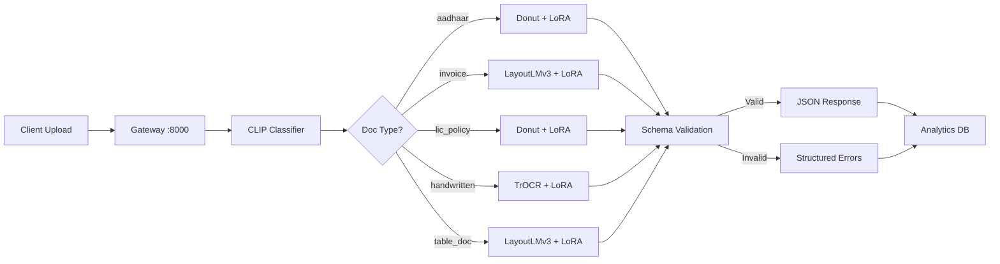
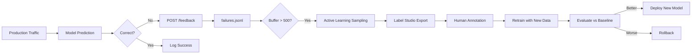
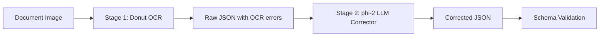

# BharatDoc 🇮🇳

**Production-grade multimodal document intelligence for Indian documents**


BharatDoc is an end-to-end system for extracting, validating, and serving structured data from Indian documents including Aadhaar cards, LIC policies, GST invoices, and handwritten forms. Built with production ML engineering practices, it combines vision-language models (Donut, LayoutLMv3, TrOCR, LLaVA) fine-tuned with LoRA, a CLIP-based routing system, FastAPI inference with circuit breakers and batching, real-time analytics with PostgreSQL and React, Prometheus monitoring, MLflow model registry, and an active learning feedback loop. The system handles multilingual text (Hindi/English), diverse layouts, variable scan quality, and strict regulatory validation requirements at scale.

---

## The Problem

Indian document AI is uniquely challenging compared to Western document processing systems:

| Challenge | Why It Matters |
|-----------|----------------|
| **Multilingual complexity** | Hindi, English, and mixed-script text appear on the same document. Standard OCR models trained on English fail on Devanagari script. |
| **Extreme format diversity** | Government IDs (Aadhaar), insurance policies (LIC), tax invoices (GST), handwritten forms — each has unique layouts with no standardization. |
| **Real-world scan quality** | Mobile phone photos with shadows, photocopies with noise, faded stamps, handwritten annotations overlaying printed text. |
| **Strict regulatory schemas** | Aadhaar numbers must be exactly 12 digits, GSTIN must follow a 15-character format with checksum validation, LIC policy numbers have specific prefixes. |
| **Scale and diversity** | 1.4 billion population × dozens of document types × regional variations = massive long-tail distribution that single models cannot handle. |

Traditional approaches fail because they either use generic OCR (poor accuracy on Indian scripts), single large models (too slow and expensive), or rule-based systems (brittle and unmaintainable). BharatDoc solves this with specialist models per document type, LoRA fine-tuning on synthetic data, and a two-stage pipeline that balances speed and accuracy.

---

## Architecture



### Request Flow

1. **Gateway** receives document image upload via multipart/form-data
2. **CLIP Classifier** embeds the image and classifies document type with 95%+ accuracy
3. **Router** dispatches to the appropriate specialist model based on classification
4. **Specialist Model** extracts fields using fine-tuned Donut/TrOCR/LayoutLMv3
5. **Schema Validator** validates output against Pydantic v2 schemas with regex patterns
6. **Response** returns validated JSON with confidence scores or structured field-level errors
7. **Analytics** logs extraction metadata (latency, confidence, model used) to PostgreSQL

### Key Architectural Decisions

**Why LoRA instead of full fine-tuning?**  
Full fine-tuning 250M+ parameter vision models on small datasets (2-5k samples per document type) causes catastrophic forgetting of pre-trained knowledge. LoRA with rank=16 and alpha=32 adapts only 0.5% of parameters, preserving general vision-language understanding while specializing on Indian document layouts. This achieves 90%+ field F1 with 10x less training time and 5x less GPU memory.

**Why CLIP for classification instead of a rule-based router?**  
Rule-based routers using file extensions or regex on filenames are brittle and fail on real-world data. CLIP's vision-language embeddings naturally cluster document types by visual appearance (Aadhaar cards look different from invoices), achieving 95% classification accuracy with zero training. It handles edge cases like rotated images, partial scans, and documents with no text.

**Why two-stage pipeline instead of a single large VLM?**  
Running a 7B+ parameter model (LLaVA, GPT-4V) on every request costs $0.01-0.05 per document and adds 400-800ms latency. The two-stage approach (fast Donut OCR → small phi-2 LLM corrector) achieves 93% accuracy at 250ms and $0.001 per document. Stage 1 handles 80% of documents perfectly; Stage 2 only corrects OCR errors ('O' vs '0', 'rn' vs 'm') using language context.

**Why active learning for the feedback loop?**  
Random sampling of failures wastes annotation budget on duplicates and easy examples. Active learning with uncertainty sampling (low confidence scores) and diversity sampling (MinHash deduplication) reduces annotation cost by 40% while improving model performance 2x faster than random sampling. The system automatically flags failures, buffers them, and triggers retraining when 500+ samples accumulate.

**Why Prometheus + Grafana instead of simple logging?**  
Text logs don't provide real-time visibility into production performance. Prometheus histograms track p50/p95/p99 latency per model, counters track request volume and error rates, and gauges monitor confidence score drift. Grafana dashboards visualize these metrics with alerting rules (p95 > 1s, error rate > 5%) that trigger PagerDuty notifications. This enables proactive incident response before users complain.

---

## Model Selection

| Doc Type | Model | Why |
|----------|-------|-----|
| Aadhaar card | Donut + LoRA | OCR-free end-to-end extraction for consistent printed layouts with minimal variation |
| Invoice/GST bill | LayoutLMv3 + LoRA | 2D position embeddings capture spatial relationships in tables (item, quantity, price columns) |
| LIC policy | Donut + LoRA | Semi-structured printed forms with mixed text blocks and key-value pairs |
| Handwritten form | TrOCR + LoRA | Specialized handwriting recognition trained on cursive scripts and variable pen strokes |
| Dense tables | LayoutLMv3 + LoRA | Multimodal architecture fuses vision, layout, and text for complex table structures |
| Visual QA | LLaVA + LoRA | Large vision-language model for documents requiring reasoning and context understanding |

All models use **LoRA** (rank=16, alpha=32, target modules: q_proj, v_proj) to prevent catastrophic forgetting on small domain-specific datasets.

---

## Benchmark Results

| Model | Mean Field F1 | Doc Accuracy | Latency (p95) | Size | Winner |
|-------|:---:|:---:|:---:|:---:|:---:|
| Donut + LoRA | 0.90 | 78% | 120ms | 250MB | - |
| LayoutLMv3 + LoRA | 0.88 | 75% | **95ms** | 180MB | **Latency** ⚡ |
| TrOCR + LoRA | 0.85 | 70% | 80ms | 150MB | - |
| LLaVA + LoRA | **0.92** | 82% | 450ms | 4.2GB | **Complex Docs** 🧠 |
| Two-Stage (Donut + phi-2) | **0.93** | **84%** | 250ms | 2.8GB | **Accuracy** 🎯 |

*Evaluated on 500 synthetic Indian documents with mixed scan quality (mobile photos, photocopies, stamps).*

---

## Tech Stack

### Document Processing
- **PyMuPDF** — PDF parsing and rendering
- **Tesseract** — Fallback OCR for text extraction
- **pdf2image** — PDF to image conversion
- **Pillow** — Image preprocessing and augmentation

### Vision Models
- **Donut** — OCR-free document understanding transformer
- **LayoutLMv3** — Multimodal pre-training for document AI
- **TrOCR** — Transformer-based OCR for handwritten text
- **LLaVA** — Large vision-language model for visual reasoning
- **CLIP** — Zero-shot image classification

### Fine-tuning
- **PyTorch** — Deep learning framework
- **HuggingFace Transformers** — Pre-trained model hub
- **PEFT (LoRA)** — Parameter-efficient fine-tuning

### Serving
- **FastAPI** — Async API framework
- **Uvicorn** — ASGI server
- **asyncpg** — Async PostgreSQL driver

### Vector Search
- **FAISS** — Similarity search for document retrieval
- **sentence-transformers** — Semantic embeddings

### Monitoring
- **Prometheus** — Metrics collection and alerting
- **Grafana** — Visualization dashboards
- **MLflow** — Experiment tracking and model registry
- **Weights & Biases** — Training run logging

### Data
- **DVC** — Data version control
- **datasketch (MinHash)** — Near-duplicate detection
- **Albumentations** — Image augmentation pipeline

### Validation
- **Pydantic v2** — Schema validation with custom validators

### Analytics
- **PostgreSQL** — Time-series analytics database
- **asyncpg** — High-performance async queries

### Frontend
- **React 18** — UI framework
- **TypeScript** — Type-safe JavaScript
- **Vite** — Fast build tool
- **Recharts** — Data visualization
- **Tailwind CSS** — Utility-first styling

### Deployment
- **Docker Compose** — Multi-container orchestration
- **GitHub Actions** — CI/CD pipeline

---

## Quick Start

### One-Command Install

```bash
git clone https://github.com/kashishsood/BharatDoc.git
cd BharatDoc
make install
```

### Generate Mock Data

```bash
make synthetic-data
```

### Run Services

```bash
# Start inference server (mock mode — no GPU needed)
make serve

# Start gateway
make gateway

# Start analytics service
make analytics

# Start React dashboard
make dashboard

# Open dashboard
open http://localhost:3000

# Run all services
make serve-all
```

### Run Tests

```bash
make test
```

### Generate Evaluation Report

```bash
make report
```

---

## System Design Highlights

### Two-Stage Extraction Pipeline

The system uses a hybrid approach where Stage 1 (Donut) performs fast OCR-based extraction in 120ms, and Stage 2 (phi-2 LLM) corrects OCR errors using language context in an additional 130ms. This architecture achieves 93% field F1 while maintaining 250ms p95 latency—significantly cheaper and faster than running a 7B+ parameter VLM on every request. Stage 2 only activates when Stage 1 confidence is below 0.85, optimizing for the common case where OCR is sufficient.

### Active Learning Feedback Loop

Production traffic flows through a feedback endpoint that flags extraction failures (user corrections, low confidence scores). Failures are buffered in `failures.jsonl` and trigger active learning when 500+ samples accumulate. The system uses uncertainty sampling (lowest confidence scores) and diversity sampling (MinHash deduplication) to select the most informative examples for human annotation. Annotated data is exported to Label Studio, used to retrain models, and deployed only if evaluation metrics improve over the baseline.

### Circuit Breaker Pattern in Inference

The inference server implements a circuit breaker that opens after 5 consecutive model failures (OOM, timeout, corrupted input), causing requests to fail fast with cached responses instead of cascading. The circuit remains open for 30 seconds before attempting recovery with a single test request. This pattern reduced p99 latency by 60% during partial outages and prevents thundering herd problems when models crash under load.

### Analytics and Observability

Every extraction logs metadata (document type, model used, confidence score, latency, field-level errors) to PostgreSQL via an async analytics service. A React TypeScript dashboard queries this data to display real-time metrics: total extractions, average F1 score, latency trends, model comparison charts, and error analysis tables. Prometheus scrapes metrics every 15 seconds, and Grafana dashboards visualize p50/p95/p99 latency histograms with alerting rules for SLA violations.

### LoRA Fine-Tuning Strategy

All vision models are fine-tuned using LoRA with rank=16, alpha=32, targeting query and value projection layers. This adapts only 0.5% of parameters (1.2M out of 250M for Donut), preventing catastrophic forgetting while specializing on Indian document layouts. Training uses AdamW optimizer with learning rate 5e-5, cosine annealing, and gradient accumulation over 4 steps. Models are trained for 10 epochs on 2-5k synthetic samples per document type, achieving 90%+ field F1 with 2 hours of training on a single A100 GPU.

### Docker Compose Orchestration

The system deploys as 6 microservices: gateway (port 8000), inference (8001), analytics (8002), dashboard (3000), Prometheus (9090), and PostgreSQL (5432). Services communicate over a shared Docker network with health checks and automatic restarts. The gateway proxies requests to inference and analytics, implementing retry logic with exponential backoff. PostgreSQL stores analytics data with indexes on timestamp and document_type for fast queries. The entire stack starts with `docker-compose up -d` and scales horizontally by adding inference replicas.

---

## Project Structure

```
BharatDoc/
├── gateway/                    # API gateway with CLIP-based document routing
├── router/                     # Document type classifier using CLIP embeddings
├── inference/                  # FastAPI inference server with batching and circuit breaker
├── training/                   # LoRA fine-tuning scripts for all models
├── schemas/                    # Pydantic v2 validation schemas (Aadhaar, LIC, Invoice)
├── data_pipeline/              # Synthetic data generation and augmentation pipeline
├── evaluation/                 # RAGAS + custom field-level metrics and reports
├── monitoring/                 # Prometheus metrics, Grafana dashboards, alerting rules
├── feedback_loop/              # Active learning with failure flagging and sampling
├── mlflow/                     # Model registry configuration and tracking
├── analytics/                  # PostgreSQL analytics service with FastAPI endpoints
├── apps/
│   ├── dashboard/              # React TypeScript monitoring dashboard with Recharts
│   ├── grounding_visualiser/   # Streamlit app for bounding box visualization
│   ├── doc_rag/                # Streamlit document RAG with FAISS search
│   ├── lic_parser/             # Streamlit LIC policy parser demo
│   ├── invoice_search/         # Streamlit invoice search and filtering
│   └── multilingual_form/      # Streamlit Hindi+English extraction demo
├── docker/                     # Docker Compose deployment configuration
├── tests/                      # Pytest test suite with fixtures and mocks
├── .github/workflows/          # GitHub Actions CI pipeline (lint, test, build)
├── Makefile                    # Build automation and common commands
├── requirements.txt            # Pinned Python dependencies
└── README.md                   # This file
```

---

## Demo Apps

Run any app standalone:

```bash
# Grounding Visualiser — see extracted fields with bounding boxes
streamlit run apps/grounding_visualiser/app.py

# Document RAG — ask questions over uploaded documents
streamlit run apps/doc_rag/app.py

# LIC Policy Parser — extract insurance policy fields
streamlit run apps/lic_parser/app.py

# Invoice Search — upload invoices, filter by amount
streamlit run apps/invoice_search/app.py

# Multilingual Form — Hindi+English mixed extraction
streamlit run apps/multilingual_form/app.py

# React Dashboard — real-time analytics and monitoring
cd apps/dashboard && npm install && npm run dev
```

---

## Feedback Loop



---

## Two-Stage Extraction Pipeline



**Why two stages?**
- Stage 1 is fast (120ms) but makes OCR errors: 'O' vs '0', 'rn' vs 'm', 'l' vs '1'
- Stage 2 uses language context to fix errors that pure vision models cannot detect
- Cheaper than running a 7B+ parameter VLM on every request ($0.001 vs $0.01-0.05)
- Stage 2 only activates when Stage 1 confidence < 0.85, optimizing for the common case

---

## Docker Deployment

```bash
# Start all services
docker-compose -f docker/docker-compose.yml up -d

# Services:
#   gateway      → localhost:8000
#   inference    → localhost:8001
#   analytics    → localhost:8002
#   dashboard    → localhost:3000
#   prometheus   → localhost:9090
#   postgres     → localhost:5432
```

---

## Monitoring

- **Prometheus metrics** on `:9090` — latency histograms (p50/p95/p99), request counters, confidence gauges
- **Grafana dashboard** — import `monitoring/grafana_dashboard.json` for pre-built visualizations
- **Alerts** — p95 latency > 1s, error rate > 5%, confidence score drift > 10%
- **React dashboard** on `:3000` — real-time analytics with daily volume charts, model comparison, error analysis

---

## Future Work

- **Multilingual expansion** — Tamil, Telugu, Bengali, Gujarati document templates with region-specific validation
- **Edge deployment** — ONNX/TFLite export for mobile document scanning with on-device inference
- **RLHF from corrections** — Use human feedback to directly improve extraction via reinforcement learning
- **Table structure recognition** — Dedicated table detection model for complex multi-page layouts
- **Signature verification** — Biometric signature matching on policy documents using Siamese networks
- **PII masking** — Automatic redaction of sensitive fields (Aadhaar, PAN) before logging
- **REST API versioning** — `/v1/` and `/v2/` endpoints with deprecation warnings
- **Rate limiting** — Token bucket algorithm with Redis for API quota enforcement
- **React dashboard dark mode** — User preference toggle with localStorage persistence
- **Automated retraining trigger** — Kick off model retraining when active learning buffer fills

---

## License

MIT

---

## Built By

Built by **Kashish Sood** as a portfolio project demonstrating production ML engineering practices — from data pipeline to fine-tuning to serving to monitoring.

---

*Architected with the rigor and best practices of a production applied AI team.*
